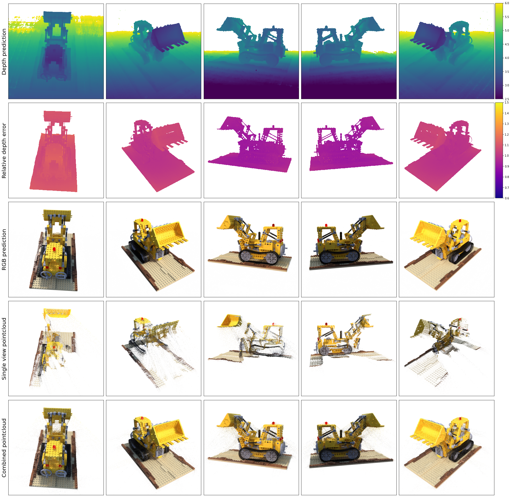

# Michael Ebenstein's Bachelor project 
This repository contains the code to my bachelors project.

> Over the last few years Neural Radiance Fields (NeRF) have achieved breakthrough results for
the tasks of Novel View Synthesis (NVS) and Neural Scene Representation (NSR). This work
looks at the main advancements made to NeRFs, specifically on speed improvements during
the training process, covering literature up to January 2022. The various methods will be
compared on general terms and also with a focus on indoor scenes captured with a conventional
smart phone, as this represents a real-world use case of NeRFs and goes against some simple
assumptions made by existing methods. The main improvements will be evaluated in respect
to ray sampling, input encoding, regularisation, network structure and task formulation. This
analysis is then utilized to implement an architecture that extends the capabilities of state-of-
the-art models and is able to represent a monocular RGB sequence within a couple of minutes.
Experimental results with different architectures will be provided, with a specific focus on
implementation considerations to best utilize GPUs for training.

# Results

## Convex scene


## Concave scene


## Comparison to original NeRF geometry


# Instructions
## Requirements
+ [FFMPEG](https://www.ffmpeg.org/download.html)
+ [COLMAP](https://colmap.github.io/install.html)
+ [tiny-cuda-nn](https://github.com/NVlabs/tiny-cuda-nn.git)

## Installation

+ Clone this repository using `git clone https://github.com/mebenstein/bachelor_proj.git --recurse-submodules`
+ Download the pre-trained weights for [DeblurGANv2](https://github.com/VITA-Group/DeblurGANv2) from their repository and save them in the `deblurganv2` folder as `best_fpn.h5`

## Data preperation

1. Create a directory for your test sequence
    ```bash
    mkdir data/test
    mv video.mp4 data/test/
    ```
2. Generate a deblurred video
    ```bash
    cd deblurganv2
    python predict.py ../data/test/video.mp4 --video
    mv submit/video_deblur.mp4 ../data/test/
    cd ..
    ```
3. Convert video to frames
    ```bash
    cd data/test
    ffmpeg -i video_deblur.mp4 -vf fps=30 unfiltered_images/%04d.png
    ```
4. Filter images based on bluriness
    ```bash
    python ../../image_filtering.py unfiltered_images images <frame_interval:int>
    ```
5. Estimate poses with COLMAP
    ```bash
    python ../../torch-ngp/colmap2nerf.py --images images --colmap_matcher exhaustive --run_colmap
    cd ../../
    ```

## Usage
1. Train representation. Execute `python learn_scene.py --help` to see the available paramters. The weights will be stored in a workspace folder. (During the first execution PyTorch bindings will be compiled and thus it make take a while to start)
2. View representation. Execute `python view_scene.py --help`

## Misc
+ `misc` contains various Jupyter Notebooks used for benchmarking and other tests for the report
+ `grid_encoding_test.py` contains an experimental implementation of the neural hash encoding that was created in order to help me understand the technology better
+ `kilonerf.py` includes a smaller KiloNeRF benchmark

## Data
You can download the data used for the report [here](https://drive.google.com/drive/folders/1d_851b8vshHdhXx-8HOxBbd9CP8Mth4_?usp=sharing).

## License
Please see the `LICENSE` file.